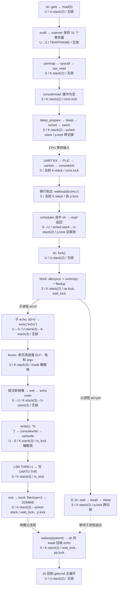

# 材料一：全系统控制流图（模块级）

追踪 Shell 执行 `echo hi` 的全生命周期：自用户敲下回车起，至屏幕显示 `hi` 止。

**参考树**：`reference/xv6-riscv`，HEAD `9e3161a`（2026-09-04）。以下函数名、行为、寄存器偏移均取自该树实际代码。
**标注记号**：栈 = `U-stack` 用户栈 / `K-stack(pid)` 该进程内核栈 / `sched-stack(cpu)` 调度器栈；特权级 = `U` / `S` / `M`；锁 = 该阶段持有的自旋锁或睡眠锁。

> 本文件的 `💭` 批注为阅读过程中记录的疑点，验收前需本人复核并补充自己的观察。

---

## 命名与结构差异（相对旧版 xv6 与网络资料）

本轮阅读中确认的差异，全部以参考树为准：

| 旧版 | 参考树 | 影响 |
| --- | --- | --- |
| `usertrapret()` | `prepare_return()` | 且**不再由它跳转**，见下条 |
| `usertrap()` 返回 `void`，末尾调用 `usertrapret` | `usertrap()` **返回 `uint64 satp`** | `uservec` 中 `jalr t0` 的返回地址正是 `userret` 的第一条指令，usertrap 返回后**直接落入** `userret`，satp 由 `a0` 传递 |
| `sleep(chan, lk)` 单段 | `sleep_prepare(chan)` + `sleep()` 两段 | 调用方在两者之间释放自己的锁，不再把锁传进 sleep |
| `fork` / `exit` / `wait` / `exec` / `kill` | `kfork` / `kexit` / `kwait` / `kexec` / `kkill` | 内核侧一律加 `k` 前缀 |
| `printf()` | `printk()` | |
| `userinit()` 加载内嵌 `initcode.S` | `userinit()` 只 `allocproc` + 置 `RUNNABLE`；由 `forkret()` 调 `kexec("/init", …)` | 第一个用户程序从**文件系统**加载，不再内嵌 |
| M 态 `timervec` + CLINT `mtimecmp` 转发软件中断 | `clockintr()` 直接写 **`stimecmp`**（Sstc 扩展） | 时钟中断**直接进 S 态**，全程无 M 态参与 |
| UART 发送用环形缓冲 + `uart_tx_lock` 自旋锁 + `uartstart()` | `uartwrite()` 用**睡眠锁 `tx_lock`** + `sleep_prepare(&tx_chan)/sleep()` | 无发送缓冲区，无 `uartstart` |
| 惰性分配是 lab 习题 | `vmfault()` 已在上游 `usertrap` 中处理 scause 13/15 | |

---

## 骨干时序

```
sh (pid 2)                     内核                          echo (pid 3)
────────────────────────────────────────────────────────────────────────
getcmd → gets → read(0,…)
   │ ecall ─────────────────▶ uservec → usertrap → syscall
   │                          sys_read → fileread → consoleread
   │                          cons.r == cons.w → sleep_prepare(&cons.r)
   │                          sleep() → SLEEPING → sched → swtch
   │                                 [CPU 转入 scheduler，wfi]
   │                          ◀── UART RX 中断（PLIC，scause 0x…009）
   │                          devintr → uartintr → consoleintr
   │                          '\n' → cons.w = cons.e → wakeup(&cons.r)
   │                          scheduler 选中 sh → swtch 回 K-stack(2)
   ◀── sret ───────────────── either_copyout 拷回用户缓冲，read 返回
fork1() → fork()
   │ ecall ─────────────────▶ kfork：allocproc / uvmcopy / *np->trapframe
   │                          np->trapframe->a0 = 0；filedup ×3；RUNNABLE
   ├─ 父：返回 pid=3 ──▶ wait(0) → kwait → sleep_prepare(p) → sleep()
   └─ 子：返回 0 ─────────────────────────────────────▶ runcmd → exec("echo")
                              kexec：namei → proc_pagetable → uvmalloc
                                     + loadseg → 栈与 guard page → copyout argv
                                     → 换 p->pagetable → epc = 0x70 → 释放旧表
                              ◀─ sret ─────────────────▶ start → main(2, argv)
                                                          write(1,"hi",2)
                              sys_write → filewrite → consolewrite
                              either_copyin → uartwrite
                              sleep_prepare(&tx_chan)
                              LSR.TX_IDLE? → 是：WriteReg(THR,'h') … 'i'
                                             否：sleep()，由 uartintr 唤醒
                                                          write(1,"\n",1)
                                                          exit(0)
                              kexit：fileclose ×3 → reparent
                                     → wakeup(p->parent) → ZOMBIE → sched
   ◀── sh 的 kwait 被唤醒，扫到 ZOMBIE → freeproc → 返回 pid=3
回到 getcmd 主循环
```

---

## 阶段分解表

`p` = 当前进程的 `struct proc`。行号为参考树中的位置。

### A. Shell 读取命令行

| # | 阶段 | 关键代码 | 栈 | 特权级 | 持锁 |
| --- | --- | --- | --- | --- | --- |
| A1 | 打印提示符并逐字符读入 | `user/sh.c:getcmd` → `write(2,"$ ",2)`；`gets()` 每次 `read(0,&c,1)` | U-stack(2) | U | — |
| A2 | `ecall` 陷入 | `user/usys.S`（由 `usys.pl` 生成）置 `a7 = SYS_read` 后 `ecall` | U-stack(2) | U→S | — |
| A3 | 保存现场 | `trampoline.S:uservec`：`csrw sscratch,a0`；`li a0,TRAPFRAME`；`sd` 31 个寄存器；再由 `sscratch` 取回用户 `a0` 存入偏移 112 | 尚无内核栈 | S | — |
| A4 | 切内核态运行环境 | `ld sp,8(a0)`（`kernel_sp`）、`ld tp,32(a0)`、`ld t0,16(a0)`、`ld t1,0(a0)`；`sfence.vma` → `csrw satp,t1` → `sfence.vma`；`jalr t0` | → K-stack(2) | S | — |
| A5 | `usertrap()` | `trap.c:38`。检查 `SPP`；`w_stvec(kernelvec)`；`p->trapframe->epc = r_sepc()` | K-stack(2) | S | — |
| A6 | 系统调用分支 | `scause == 8` → `p->trapframe->epc += 4` → `intr_on()` → `syscall()` | K-stack(2) | S | — |
| A7 | 系统调用分发 | `syscall.c`：`num = p->trapframe->a7`；`p->trapframe->a0 = syscalls[num]()` | K-stack(2) | S | — |
| A8 | 文件层 | `sysfile.c:sys_read` → `argfd` 取 `p->ofile[0]` → `fileread(f,addr,n)` | K-stack(2) | S | — |
| A9 | 设备分发 | `file.c:fileread`：`f->type == FD_DEVICE` → `devsw[f->major].read(1,addr,n)`，`major == CONSOLE(1)` | K-stack(2) | S | — |
| A10 | 无输入，登记等待 | `console.c:consoleread`：`acquire(&cons.lock)`；`cons.r == cons.w` → `sleep_prepare(&cons.r)` → `release(&cons.lock)` → `sleep()` | K-stack(2) | S | `cons.lock`（在 `sleep()` 前已释放） |
| A11 | 真正睡下 | `proc.c:sleep`：`acquire(&p->lock)`；`p->chan != 0` 才置 `SLEEPING` 并 `sched()` | K-stack(2) | S | `p->lock` |
| A12 | 交出 CPU | `sched()` → `swtch(&p->context, &mycpu()->context)` | K-stack(2) → sched-stack | S | `p->lock` **跨 swtch 持有** |
| A13 | 调度器空转 | `scheduler()` 扫 `proc[]` 无 `RUNNABLE` → `asm volatile("wfi")` | sched-stack | S | 逐个 `acquire/release p->lock` |

> 💭 A10–A11 的两段式睡眠是本版最值得注意的改动。旧版 `sleep(chan, lk)` 必须把调用方的锁传进去，由 `sleep` 内部原子地"放锁+睡"；新版把它拆成 `sleep_prepare` 先在 `p->lock` 保护下登记 `p->chan`，调用方再自行释放 `cons.lock`，最后 `sleep()` 重新取 `p->lock` 并**检查 `p->chan` 是否已被清零**。丢失唤醒因此不再靠"锁的原子传递"避免，而是靠 `wakeup()` 把 `p->chan` 置 0 这个**可被事后观察的标记**——即使唤醒发生在 `release(&cons.lock)` 与 `sleep()` 之间，`sleep()` 也会看到 `chan == 0` 而直接返回。

### B. 键盘输入抵达与唤醒

| # | 阶段 | 关键代码 | 栈 | 特权级 | 持锁 |
| --- | --- | --- | --- | --- | --- |
| B1 | UART 收到字符，PLIC 上报 | `scause = 0x8000000000000009`（S 态外部中断） | — | S | — |
| B2 | 进入 trap | 若被中断者在用户态走 `uservec`→`usertrap`；若在内核态走 `kernelvec`→`kerneltrap` | 视来源 | S | — |
| B3 | 设备识别 | `trap.c:devintr`：`plic_claim()` → `irq == UART0_IRQ(10)` → `uartintr()` → 末尾 `plic_complete(irq)` | K-stack | S | — |
| B4 | 取字符 | `uart.c:uartintr`：`ReadReg(ISR)` 应答；循环 `uartgetc()`（查 `LSR_RX_READY`，读 `RHR`）→ `consoleintr(c)` | K-stack | S | — |
| B5 | 行缓冲与回显 | `console.c:consoleintr`：`acquire(&cons.lock)`；回显 `consputc(c)`；存入 `cons.buf[cons.e++ % INPUT_BUF_SIZE]` | K-stack | S | `cons.lock` |
| B6 | 整行到达 → 唤醒 | `c == '\n'` → `cons.w = cons.e` → `wakeup(&cons.r)` | K-stack | S | `cons.lock` |
| B7 | 唤醒动作 | `proc.c:wakeup`：遍历 `proc[]`，`p->chan == chan` → `p->chan = 0`；若 `state == SLEEPING` → `RUNNABLE` | K-stack | S | 逐个 `p->lock` |
| B8 | 重新调度到 sh | `scheduler` 取到 `RUNNABLE` → `p->state = RUNNING` → `swtch(&c->context,&p->context)` | sched-stack → K-stack(2) | S | `p->lock`（由 sh 侧的 `sleep()` 释放） |
| B9 | `sleep()` 返回 | 回到 `consoleread` 循环：`acquire(&cons.lock)`，`cons.r != cons.w`，取字符 | K-stack(2) | S | `cons.lock` |
| B10 | 拷回用户缓冲 | `either_copyout(1,dst,&cbuf,1)` → `copyout(p->pagetable, p->sz, …)`；遇 `'\n'` 结束 | K-stack(2) | S | `cons.lock` |
| B11 | 逐层返回并回用户态 | `fileread` → `sys_read` → `syscall` 写 `p->trapframe->a0` → `usertrap` 尾部 → `prepare_return()` → `return MAKE_SATP(p->pagetable)` | K-stack(2) | S | — |
| B12 | 恢复现场 | `usertrap` 返回落入 `trampoline.S:userret`（`a0` = satp）：`fence.i`；`sfence.vma`；`csrw satp,a0`；`sfence.vma`；`li a0,TRAPFRAME`；`ld` 31 个寄存器；最后 `ld a0,112(a0)` | → U-stack(2) | S→U | — |
| B13 | 返回用户 | `sret`：`pc ← sepc`，`SIE ← SPIE`，特权级 ← `SPP`(=U) | U-stack(2) | U | — |

> 💭 B12 中"最后才恢复 `a0`"是必须的：`a0` 全程充当 TRAPFRAME 的基址寄存器，若提前恢复就没有指针再去读其余字段。`uservec` 保存侧的对称做法是先把用户 `a0` 藏进 `sscratch`，腾出 `a0` 做基址，等其余 31 个存完再 `csrr t0,sscratch; sd t0,112(a0)`。

### C. fork 与 exec

| # | 阶段 | 关键代码 | 栈 | 特权级 | 持锁 |
| --- | --- | --- | --- | --- | --- |
| C1 | sh 调 `fork1()` | `user/sh.c:fork1` → `fork()` → `ecall` | U-stack(2) | U→S | — |
| C2 | 分配子进程 | `proc.c:kfork` → `allocproc()`：取 `UNUSED` 槽、`allocpid()`、`kalloc()` 得 trapframe 页、`proc_pagetable(p)`、`context.ra = forkret`、`context.sp = p->kstack + PGSIZE` | K-stack(2) | S | `np->lock` |
| C3 | 复制地址空间 | `uvmcopy(p->pagetable, np->pagetable, p->sz)`：逐页 `kalloc` + `memmove` + `mappages`（**本版为完全复制，无 COW**）；`np->sz = p->sz` | K-stack(2) | S | `np->lock` |
| C4 | 复制寄存器现场 | `*(np->trapframe) = *(p->trapframe)`；随后 `np->trapframe->a0 = 0` | K-stack(2) | S | `np->lock` |
| C5 | 复制文件描述符 | `for i<NOFILE: np->ofile[i] = filedup(p->ofile[i])`（`f->ref++`）；`np->cwd = idup(p->cwd)` | K-stack(2) | S | `np->lock` |
| C6 | 挂父子关系并就绪 | `release(&np->lock)`；`acquire(&wait_lock); np->parent = p; release(&wait_lock)`；再 `acquire(&np->lock); np->state = RUNNABLE; release` | K-stack(2) | S | `wait_lock` → `np->lock` |
| C7 | 父返回 pid，子返回 0 | 父：`kfork` 返回 `pid` → `a0 = 3`。子：首次被调度时 `swtch` 到 `context.ra = forkret` → `forkret` 释放 `p->lock` → `prepare_return()` → 手动跳 `userret`，从 trapframe 恢复出 `a0 = 0` | 各自 K-stack | S→U | — |
| C8 | 子进程执行命令 | `sh.c:runcmd` `case EXEC` → `exec(ecmd->argv[0], ecmd->argv)` → `ecall` | U-stack(3) | U→S | — |
| C9 | 打开可执行文件 | `exec.c:kexec`：`begin_op()`；`namei("echo")`；`ilock(ip)`；`readi` 读 `elfhdr`，校验 `ELF_MAGIC` | K-stack(3) | S | `ip` 睡眠锁 + 日志事务 |
| C10 | 建新页表 | `proc_pagetable(p)`：`uvmcreate()`；映射 `TRAMPOLINE`(`R\|X`)、`TRAPFRAME`(`R\|W`) | K-stack(3) | S | 同上 |
| C11 | 逐段加载 | 对每个 `ELF_PROG_LOAD`：`uvmalloc(pagetable, sz, ph.vaddr+ph.memsz, flags2perm(ph.flags))` → `loadseg()` 用 `walkaddr` 取物理页后 `readi` 直接写入 | K-stack(3) | S | 同上 |
| C12 | 建栈与 guard page | `sz = PGROUNDUP(sz)`；`uvmalloc(…, sz + (USERSTACK+1)*PGSIZE, PTE_W)`；`uvmclear(sz_new - (USERSTACK+1)*PGSIZE)` 清掉最低那页的 `PTE_U` 作 guard | K-stack(3) | S | — |
| C13 | 构造 argv | 逐个 `sp -= strlen+1; sp -= sp%16; copyout(...)`，地址记入 `ustack[]`；再压 `ustack[]` 本身；`p->trapframe->a1 = sp` | K-stack(3) | S | — |
| C14 | 提交新镜像 | `oldpagetable = p->pagetable`；`p->pagetable = pagetable`；`p->sz = sz`；`p->trapframe->epc = elf.entry`；`p->trapframe->sp = sp`；`proc_freepagetable(oldpagetable, oldsz)`；`return argc` → `a0` | K-stack(3) | S | — |
| C15 | 回到用户态 | `usertrap` 尾部 `prepare_return()` → `userret` → `sret`，从 `epc = 0x70`（`user/ulib.c:start`）开始执行，`start` 再调 `main(a0=argc, a1=argv)` | → U-stack(3) | S→U | — |

> 💭 C14 是全流程唯一的"提交点"：在此之前所有失败都跳 `bad`，只释放**新建的** `pagetable`，旧地址空间原封不动，`exec` 失败后进程仍能正常返回 `-1` 继续跑（`sh.c` 里就打印 `exec %s failed`）。这条"先建新的、全部成功后再一次性换掉、最后释放旧的"的顺序，就是说明书要求的"错误分支如何回滚"的标准答案形态。注意 `p = myproc()` 在 `end_op()` 之后被**重新取了一次**（`exec.c:83`）——因为中间可能睡眠并被调度。

### D. echo 输出与退出

| # | 阶段 | 关键代码 | 栈 | 特权级 | 持锁 |
| --- | --- | --- | --- | --- | --- |
| D1 | `write(1,"hi",2)` | `user/echo.c:main` 循环写 `argv[i]`，末项后补 `"\n"` | U-stack(3) | U | — |
| D2 | 陷入并分发 | 同 A2–A9，落到 `sys_write` → `filewrite(f,addr,n)` | K-stack(3) | U→S | — |
| D3 | 设备写 | `f->type == FD_DEVICE` → `devsw[CONSOLE].write(1,addr,n)` = `consolewrite` | K-stack(3) | S | — |
| D4 | 分批搬运 | `console.c:consolewrite`：32 字节一批 `either_copyin` 到内核栈缓冲 → `uartwrite(buf,nn)` | K-stack(3) | S | — |
| D5 | 送 UART | `uart.c:uartwrite`：`acquiresleep(&tx_lock)`；循环 `sleep_prepare(&tx_chan)`；`LSR & LSR_TX_IDLE` 则 `WriteReg(THR, buf[i])`，否则 `sleep()`；末尾 `releasesleep(&tx_lock)` | K-stack(3) | S | `tx_lock`（睡眠锁） |
| D6 | 发送完成中断 | `uartintr()`：`LSR & LSR_TX_IDLE` → `wakeup(&tx_chan)` | K-stack | S | — |
| D7 | 屏幕显示 `hi` | QEMU 把 THR 写入呈现到串口终端 | — | — | — |
| D8 | `exit(0)` | `proc.c:kexit`：遍历 `ofile[]` 逐个 `fileclose` 并置 0；`begin_op(); iput(p->cwd); end_op()`；`p->cwd = 0` | K-stack(3) | S | 日志事务 |
| D9 | 交接子进程、唤醒父进程 | `acquire(&wait_lock)`；`reparent(p)` 把子进程过继给 `initproc`；`wakeup(p->parent)` | K-stack(3) | S | `wait_lock` |
| D10 | 变僵尸并让出 | `acquire(&p->lock)`；`p->xstate = status`；`p->state = ZOMBIE`；`release(&wait_lock)`；`sched()`（**不再返回**） | K-stack(3) → sched-stack | S | `p->lock` 跨 `swtch` |
| D11 | 父进程回收 | sh 的 `kwait` 从 `sleep()` 返回 → 重扫 `proc[]` → `pp->state == ZOMBIE` → 取 `pid`、`copyout` 退出码 → `pp->parent = 0` → `freeproc(pp)` 释放 trapframe 页与页表 → 返回 `pid` | K-stack(2) | S | `wait_lock` + `pp->lock` |
| D12 | 回到主循环 | sh 的 `main` 继续 `while(getcmd(...))`，重新打印 `$ ` | U-stack(2) | U | — |

> 💭 D5 与旧版差异极大。旧版 `uartputc` 把字符塞进环形缓冲 `uart_tx_buf` 后立即返回，由 `uartstart()` 在中断驱动下逐个吐出，写者只在缓冲满时才睡；本版**没有发送缓冲区**，`uartwrite` 直接轮询 `LSR_TX_IDLE` 写 `THR`，写不进去就睡在 `tx_chan` 上等 `uartintr` 唤醒。语义因此收紧了一档：`write()` 返回时，全部字节**已被写入 THR**，而不是像旧版那样只是"进了软件队列、等中断慢慢吐"。但要注意这**不等于**字符已完成物理发送——THR 里最后那个字节仍在移位寄存器中传输，`uartwrite` 不会等它发完。这也意味着 `uartwrite` 用的是**睡眠锁**而非自旋锁——它会睡，不能持自旋锁。

另注意两段式睡眠在这里的用法：`sleep_prepare(&tx_chan)` 被放在**检查 `LSR` 之前**（`uart.c`），先登记通道再查状态。若顺序反过来，"查到忙"与"睡下"之间来的那次发送完成中断就会丢失。

---

## 三处关键跳转的现场细节

### ① `ecall`：U → S

**硬件自动完成**：`sepc ← pc`；`scause ← 8`（U 态 ecall）；`stval ← 0`；`sstatus.SPP ← 0`（记录来自 U 态）；`sstatus.SPIE ← sstatus.SIE`；`sstatus.SIE ← 0`（关中断）；`pc ← stvec`。

**软件接手**（`uservec`，此时**仍是用户页表**）：`stvec` 由 `prepare_return()` 预先指向 `TRAMPOLINE + (uservec - trampoline)`。trampoline 页在用户表与内核表中映射到**同一虚拟地址、同一物理页**，所以第 A4 步 `csrw satp, t1` 换表之后，`pc` 指向的下一条指令仍然有效——这正是这一页必须"两边同址映射"的原因。换表前后各有一条 `sfence.vma`：前一条保证之前的访存都在旧表下完成，后一条刷掉过期的用户表项。

用户页表能被访问的窗口在换表那一刻结束，所以**所有需要从用户空间取的东西必须在换表前取完**——`uservec` 因此把 `kernel_sp` / `kernel_hartid` / `kernel_trap` / `kernel_satp` 全部预存在 TRAPFRAME 里（由上一次 `prepare_return()` 填好），换表前一次性 `ld` 出来。

`sepc` 在 `usertrap` 里立刻被存进 `p->trapframe->epc`（`trap.c:52`），因为 `intr_on()` 之后再来一次中断就会覆盖 `sepc`。系统调用路径要 `+4`（`sepc` 指向 `ecall` 本身，返回时要跳过它）；中断路径**不加**（被打断的指令没执行完，必须重来）。

### ② `swtch`：进程内核栈 ↔ 调度器栈

`swtch` 只保存/恢复 `struct context` 的 14 个字段：`ra`、`sp`、`s0–s11`。caller-saved 寄存器不必保存，因为 `swtch` 是**被 C 函数正常调用**的——编译器已按 RISC-V 调用约定在调用点把需要存活的 caller-saved 寄存器压在栈上了。换 `sp` 即换栈，换 `ra` 即决定返回到哪；恢复后从对方上次 `swtch` 的返回点继续。

`p->lock` 的不变式：**`sched()` 的调用方必须持有 `p->lock` 且只持有它**（`sched()` 开头四个 `panic` 就在断言这件事：`holding(&p->lock)`、`noff == 1`、`state != RUNNING`、`intr_get() == 0`）。锁跨越 `swtch` 由**对方**释放：进程侧 `swtch` 出去后，`scheduler()` 在循环末尾 `release(&p->lock)`；反向进来时 `scheduler()` 持锁 `swtch` 进程序，由进程侧的 `sleep()` / `yield()` / `forkret()` 释放。这样才能保证"改 `state` → 换栈"之间没有窗口让别的核看到一个 `RUNNABLE` 却仍在本核栈上运行的进程。

> 💭 `scheduler()` 里 `swtch` 返回后紧跟一句 `mycpu()->intena = 0`（`proc.c:456`），旧版没有。含义是：刚切回调度器时不要让随后的 `release(&p->lock)` 顺手把中断打开——`intena` 记录的是"进入临界区前中断是否开着"，而这个值属于**刚才那个内核线程**，不属于当前 CPU 的调度器上下文，直接沿用会在错误的时刻开中断。

### ③ `sret`：S → U

`prepare_return()`（`trap.c:101`）做四件事：

1. `intr_off()` —— 从这里到 `sret` 之间 `stvec` 会被改向 `uservec`，若此时来中断就会以内核态身份跳进为用户态准备的入口，后果是灾难性的
2. `w_stvec(TRAMPOLINE + (uservec - trampoline))` —— 下次陷入走用户入口
3. 回填 trapframe 的 `kernel_satp` / `kernel_sp`(`p->kstack + PGSIZE`) / `kernel_trap`(`usertrap`) / `kernel_hartid` —— 供下次 `uservec` 使用
4. `sstatus.SPP ← 0`、`sstatus.SPIE ← 1`、`sepc ← p->trapframe->epc`

`sret` 依赖 `sepc`（跳哪）、`sstatus.SPP`（回到哪个特权级）、`sstatus.SPIE`（回去后是否开中断）、以及 `userret` 刚写好的 `satp`（用哪张表）。缺一项都回不去：`sepc` 错则跳飞；`SPP` 若仍为 1 就回不到 U 态；`stvec` 忘了改回 `uservec`，则用户态下一次 `ecall` 会跳进 `kernelvec`，而 `kerneltrap()` 第一件事就是 `panic("kerneltrap: not from supervisor mode")`。

---

## 全系统控制流图

下面的电子图稿把完整链路压缩成可逐段口述的骨架。每个节点末尾依次标注“特权级 / 当前栈 / 持锁”；现场手绘时按此图展开，并结合上面的阶段表补充源码行号。



> 💭 **手绘复核点**：图中 `p->lock` 跨 `swtch` 由对端释放；`kexec` 的提交点在新镜像完全构造成功之后；UART 写路径持有的是会睡眠的 `tx_lock`，不是自旋锁。现场图上应把这三处用不同颜色或编号圈出。
