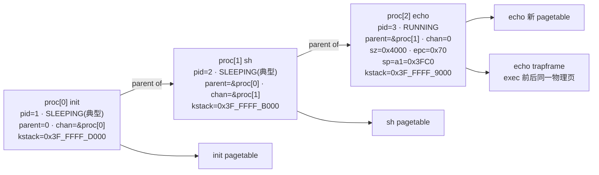
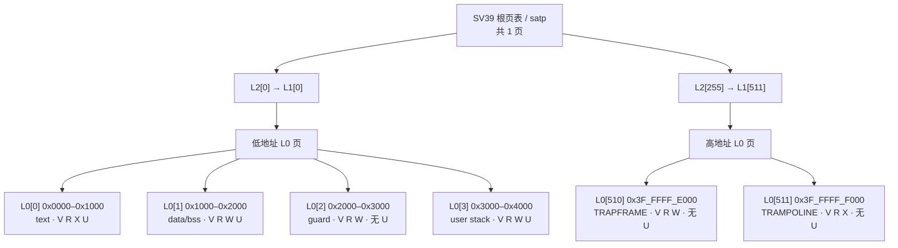
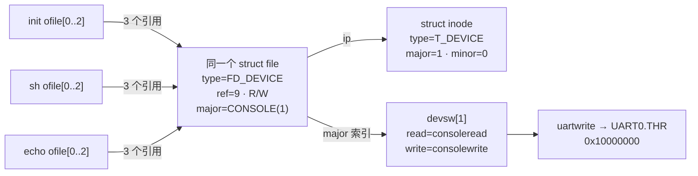

# 材料二：核心数据结构全景快照

**截面时刻**：`kexec("echo", ["echo","hi"])` 已执行完毕并返回 `argc`，echo 的首条用户指令（`epc = 0x70`）**尚未执行**。此刻 echo 仍在 S 态、位于自己内核栈上的 `usertrap()` 尾部。

**参考树**：`reference/xv6-riscv` HEAD `9e3161a`。下列数值由 `kernel/memlayout.h`、`kernel/riscv.h`、`kernel/param.h` 的常量与 `user/_echo` 的实际 ELF 布局推算，可用 `readelf` 与 QEMU Monitor 复核（见文末[复核方法](#复核方法)）。

**全局常量**

| 符号 | 值 | 出处 |
| --- | --- | --- |
| `PGSIZE` | `0x1000` | `riscv.h:389` |
| `MAXVA` | `1L << 38` = `0x40_0000_0000` | `riscv.h:417` |
| `TRAMPOLINE` | `MAXVA - PGSIZE` = `0x3F_FFFF_F000` | `memlayout.h:48` |
| `TRAPFRAME` | `TRAMPOLINE - PGSIZE` = `0x3F_FFFF_E000` | `memlayout.h:63` |
| `KSTACK(i)` | `TRAMPOLINE - (i+1)*2*PGSIZE` | `memlayout.h:52` |
| `NPROC` / `NOFILE` / `USERSTACK` | `64` / `16` / `1` | `param.h` |

---

## 快照 1：进程表

`proc[]` 槽位按 `allocproc()` 从低到高扫描 `UNUSED` 的顺序分配：init 落在 `proc[0]`，init fork 出的 shell 落在 `proc[1]`，sh fork 出的子进程落在 `proc[2]`。

**关于快照的确定性**：下表描述的是**系统进入稳定等待状态后的典型截面**。其中 `state` 一列受调度时序影响，不是可以从代码静态断言的量：

- `echo` 处于 `RUNNING` 是本截面的定义使然——`kexec` 刚返回，它必然正占用某个核。
- `init` 与 `sh` 标为 `SLEEPING`，前提是二者都已走完 `kwait()` 的 `sleep_prepare(p) → release(&wait_lock) → sleep()`。在多核（`-smp 2`）或极短的时间窗内，`sh` 可能尚停在 `kwait` 的扫描循环里而仍是 `RUNNING`/`RUNNABLE`；`kfork` 返回到 `sh` 用户态、再陷入 `wait` 也需要若干指令。
- 其余各行（槽位、`pid`、`parent`、`pagetable`、`kstack`、`ofile[]`）由 `allocproc` / `kfork` / `kexec` 的代码路径唯一决定，与调度时序无关。

现场若被追问"如何证明这一瞬间 `sh` 一定已经 `SLEEPING`"，答案是**不能静态证明**，只能用 `Ctrl-P`（`procdump()`）在运行时观测。

| 字段 | init | sh | echo |
| --- | --- | --- | --- |
| 槽位 | `proc[0]` | `proc[1]` | `proc[2]` |
| `pid` | 1 | 2 | 3 |
| `name` | `"init"` | `"sh"` | `"echo"` |
| `state` | `SLEEPING`（典型） | `SLEEPING`（典型） | `RUNNING` |
| `chan` | `&proc[0]`（自身 `struct proc` 地址） | `&proc[1]` | `0` |
| `parent` | `0` | `&proc[0]` | `&proc[1]` |
| `killed` / `xstate` | `0` / `0` | `0` / `0` | `0` / `0` |
| `sz` | init 镜像大小 | sh 镜像大小 | **`0x4000`** |
| `pagetable` | 各自根页表物理地址 | 同左 | **新表**（旧表已由 `proc_freepagetable` 释放） |
| `trapframe` | `kalloc()` 得到的物理页 | 同左 | 同左（**`kexec` 不换 trapframe 页**） |
| `kstack`（内核页表内 VA） | `0x3F_FFFF_D000` | `0x3F_FFFF_B000` | `0x3F_FFFF_9000` |
| `cwd` | `/` 的 inode | `/` | `/`（`kexec` 不改 `cwd`） |
| `ofile[0]` / `[1]` / `[2]` | 同一个 `struct file`（控制台） | 同左 | 同左 |
| `ofile[3..15]` | `0` | `0` | `0` |

`enum procstate`（`proc.h:79`）：`UNUSED, USED, SLEEPING, RUNNABLE, RUNNING, ZOMBIE`。

**关于 `chan` 的取值**：`kwait()` 中是 `sleep_prepare(p)`（`proc.c:414`），传入的是**等待者自己**的 `struct proc *`；对应地 `kexit()` 中是 `wakeup(p->parent)`（`proc.c:353`）。所以父进程睡在"自己的 proc 结构地址"这个通道上，由子进程按 `parent` 指针找回来唤醒。

**echo 的 trapframe 关键字段**（`kexec` 提交后、`sret` 之前）：

| 字段 | 值 | 来源 |
| --- | --- | --- |
| `epc` | `0x70` | `elf.entry`，即 `user/ulib.c:start`（`main` 在 `0x0`） |
| `sp` | `0x3FC0` | `kexec` 构造的用户栈指针 |
| `a0` | `2` | `kexec` 返回的 `argc`，由 `syscall()` 写入 |
| `a1` | `0x3FC0` | `argv` 数组的用户虚拟地址 |
| `kernel_sp` | `0x3F_FFFF_A000` | `p->kstack + PGSIZE` |
| `kernel_satp` / `kernel_trap` / `kernel_hartid` | 内核页表 / `usertrap` / hartid | 由 `prepare_return()` 回填 |

> 💭 `kexec` 换掉了 `p->pagetable` 却**没有换 `p->trapframe`**（那页仍是 `allocproc` 时 `kalloc` 来的同一页），只是被新页表重新映射到同一个虚拟地址 `TRAPFRAME`。因此 `exec` 前后 trapframe 里的内容是连续的——这正是 `kexec` 能把返回值 `argc` 通过 `p->trapframe->a0` 交给"新程序"的原因：写的是同一块物理内存，而新程序恰好从 `sret` 处开始读它。

---

## 快照 2：echo 的页表（SV39 三级映射树）

### 地址空间布局

`kexec` 的构造顺序（`exec.c:60–97`）决定了下表。`uvmalloc` 的基础权限是 `PTE_R | PTE_U | xperm`（`vm.c:234`），`xperm` 由 `flags2perm()` 从 ELF 段标志映射而来。

`user/_echo` 的实际程序头：

```
LOAD  VirtAddr 0x0000  FileSiz 0x8e9  MemSiz 0x8e9  Flg R E
LOAD  VirtAddr 0x1000  FileSiz 0x000  MemSiz 0x020  Flg RW
Entry point 0x70
```

| 区域 | 虚拟地址区间 | 页数 | PTE 权限位 | 说明 |
| --- | --- | --- | --- | --- |
| 代码段 `.text` | `0x0000 – 0x1000` | 1 | `V R X U`（**无 W**） | `flags2perm(R\|E)` → `PTE_X`；`main` 在 `0x0`，入口 `start` 在 `0x70` |
| 数据段 `.data/.bss` | `0x1000 – 0x2000` | 1 | `V R W U`（**无 X**） | `flags2perm(RW)` → `PTE_W`；`FileSiz 0` 故整页由 `uvmalloc` 的 `memset` 清零 |
| **guard page** | `0x2000 – 0x3000` | 1 | `V R W`（**U 被清除**） | `uvmclear()` 只清 `PTE_U`（`vm.c:339`），页仍然 valid |
| 用户栈 | `0x3000 – 0x4000` | 1 | `V R W U` | `USERSTACK = 1`，故仅 1 页；`stackbase = 0x3000` |
| —— 未映射空洞 —— | `0x4000 – 0x3F_FFFF_E000` | — | — | `p->sz = 0x4000`，其上直到 TRAPFRAME 皆无映射 |
| TRAPFRAME | `0x3F_FFFF_E000 – 0x3F_FFFF_F000` | 1 | `V R W`（**无 U、无 X**） | `proc_pagetable`（`proc.c:197`） |
| TRAMPOLINE | `0x3F_FFFF_F000 – 0x40_0000_0000` | 1 | `V R X`（**无 U、无 W**） | `proc_pagetable`（`proc.c:189`），映射到内核镜像中 `trampoline` 那一份物理页 |

`p->sz = 0x4000`。

### 三级索引与页表页

SV39 索引：`L2 = (va>>30)&0x1FF`，`L1 = (va>>21)&0x1FF`，`L0 = (va>>12)&0x1FF`。

| 虚拟地址 | L2 | L1 | L0 |
| --- | --- | --- | --- |
| `0x0000`（text） | 0 | 0 | 0 |
| `0x1000`（data） | 0 | 0 | 1 |
| `0x2000`（guard） | 0 | 0 | 2 |
| `0x3000`（stack） | 0 | 0 | 3 |
| `0x3F_FFFF_E000`（TRAPFRAME） | 255 | 511 | 510 |
| `0x3F_FFFF_F000`（TRAMPOLINE） | 255 | 511 | 511 |

```
根页表 (satp)                     ← 1 页
├─ [0]   ─▶ L1 页                 ← 1 页
│           └─ [0]   ─▶ L0 页     ← 1 页
│                       ├─ [0] → text   V R X U
│                       ├─ [1] → data   V R W U
│                       ├─ [2] → guard  V R W ·
│                       └─ [3] → stack  V R W U
└─ [255] ─▶ L1 页                 ← 1 页
            └─ [511] ─▶ L0 页     ← 1 页
                        ├─ [510] → TRAPFRAME   V R W ·
                        └─ [511] → TRAMPOLINE  V R X ·
```

**echo 的整棵页表共 5 个页表页**（1 个根 + 2 个 L1 + 2 个 L0），叶子只有 6 个 PTE。用户内存本身另占 4 个物理页，trapframe 1 页，trampoline 与内核共享不额外占页。

### 用户栈内容（`kexec` 构造结果）

`sp` 自 `sz = 0x4000` 向下生长，每次压入后按 16 字节对齐（`exec.c:103,114`）：

```
0x4000  ┬── 栈顶（sz）
        │   (11 字节对齐填充)
0x3FF0  ├── "echo\0"          ← ustack[0] 指向这里
        │   (13 字节对齐填充)
0x3FE0  ├── "hi\0"            ← ustack[1] 指向这里
        │   (8 字节对齐填充)
0x3FD0  ├── ustack[2] = 0     ← argv 数组终止项
0x3FC8  ├── ustack[1] = 0x3FE0
0x3FC0  ├── ustack[0] = 0x3FF0   ◀── sp，同时 trapframe->a1 = 0x3FC0
        │   (未使用)
0x3000  ┴── stackbase（再往下即 guard page）
```

`main(argc, argv)` 因此拿到 `a0 = 2`、`a1 = 0x3FC0`。

> 💭 guard page 的实现方式值得留意：`uvmclear()` 清的是 `PTE_U` 而**不是** `PTE_V`，页仍然是 valid、且带 `R W`。后果有两点。其一，用户态越过 `0x3000` 向下溢出时触发的是**缺页异常**（`scause` 13/15），因为 U 态访问一个 `PTE_U = 0` 的页视同无权限。其二，`usertrap` 里那条惰性分配分支（`trap.c:71`）**不会**把它误当成待分配页救回来——`vmfault()` 先调 `ismapped()`，看到 `PTE_V` 已置位就返回 0（`vm.c:466`），于是落到最后的 `else` 分支打印 `unexpected scause` 并 `setkilled(p)`。若当初 guard page 用的是"清 `PTE_V`"，`ismapped()` 会返回 0，`vmfault` 反而会给它分配一页真内存，guard 就失效了。

> 💭 TRAMPOLINE 与 TRAPFRAME 都**不带 `PTE_U`**，但用户进程运行期间它们一直在自己的页表里。这不矛盾：访问这两页的时刻 CPU 已经在 S 态（`uservec` 是硬件跳转过来后执行的第一段代码，此时特权级已切换，但 `satp` 还是用户表）。`PTE_U = 0` 恰恰是必要的——否则用户程序自己就能读写 trapframe，篡改 `kernel_satp`、`kernel_sp` 或 `kernel_trap`，等于把内核入口交给用户。

---

## 快照 3：文件表与 stdout 引用链

### 引用链

```
proc[2] (echo)
  ofile[0] ─┐
  ofile[1] ─┼──▶ struct file  (ftable 中的一项)
  ofile[2] ─┘      type      = FD_DEVICE
                   ref       = 9        ← 见下方计数推导
                   readable  = 1        （O_RDWR）
                   writable  = 1
                   ip        ────────▶ struct inode  (itable 中的一项)
                   off       = 0（FD_DEVICE 不使用）        type   = T_DEVICE
                   major     = CONSOLE = 1                  major  = 1
                                                            minor  = 0
                                                            nlink  = 1
                                                            ref    ≥ 1
                                                            dev    = ROOTDEV
                        │
                        └── filewrite() 用 f->major 查表：
                            devsw[CONSOLE].write = consolewrite
                            devsw[CONSOLE].read  = consoleread
                                （consoleinit() 装填，console.c:201）
```

注意 `f->major` 是 `struct file` **自己的**字段（`file.h:9`），`filewrite`/`fileread` 直接用它索引 `devsw[]`（`file.c:117,147`），不必再经 `f->ip`。

### `f->ref` 的推导

三个 fd 指向**同一个** `struct file`，因为 init 是用 `dup` 而非重复 `open` 建立 stdout/stderr 的（`user/init.c`）：

| 事件 | 动作 | `f->ref` |
| --- | --- | --- |
| init: `open("console", O_RDWR)` → fd 0 | `filealloc()` | 1 |
| init: `dup(0)` → fd 1 | `filedup()` | 2 |
| init: `dup(0)` → fd 2 | `filedup()` | 3 |
| init `fork` 出 sh | `kfork` 中 `filedup` ×3（`proc.c:287`） | 6 |
| sh `fork` 出 echo | `filedup` ×3 | **9** |

sh 启动时那段 `while((fd = open("console", O_RDWR)) >= 0){ if(fd >= 3){ close(fd); break; } }`（`user/sh.c:main`）会新建一个**独立的** `struct file`（`open` 每次都 `filealloc`），拿到 fd 3 后立刻 `close`，引用归零即被回收，对上表无净影响。

`kexec` 不触碰 `ofile[]`，所以 echo 换了镜像仍持有这三个 fd——这正是新程序无需自己打开就能 `write(1, ...)` 的原因。

> 💭 `kexit()` 里对每个非空 `ofile[fd]` 调 `fileclose(f)` 并置 0（`proc.c:334–340`）。`fileclose` 只做 `--f->ref`，减到 0 才真正释放并 `iput(f->ip)`。echo 退出后 `ref` 由 9 降到 6，init 与 sh 手上的 stdout 完全不受影响——引用计数在这里承担的正是"多进程共享一个打开文件、谁都不该替别人关掉它"的职责。

---

## 复核方法

上述数值均可实测复核，无需 gdb：

```bash
cd reference/xv6-riscv
make user/_echo
riscv64-unknown-elf-readelf -lW user/_echo    # 核对两个 LOAD 段与 entry
riscv64-unknown-elf-nm user/_echo | grep -E ' T (main|start)$'
```

运行期状态用 `Ctrl-P`（`consoleintr` 中的 `C('P')` → `procdump()`，`console.c:152`）打印进程表；寄存器与 CSR 用 QEMU Monitor `Ctrl-a c` → `info registers`。方法见 [`docs/07-无gdb调试手册.md`](../../docs/07-无gdb调试手册.md)。

---

## 核心数据结构全景图

### 进程表快照



`init` 与 `sh` 的 `SLEEPING` 是稳定等待状态下的典型值；严格截取极短时间窗或使用多核时，只能通过运行期观测确认，不能由静态代码强行断言。

### echo 页表快照



整棵页表占 5 个页表页，包含 6 个叶 PTE。`0x4000` 到 `TRAPFRAME` 之间未映射；guard page 仍为 `PTE_V=1`，只清除了 `PTE_U`。

### 文件表与 stdout 引用链快照



> 💭 **手绘复核点**：页表图要明确 `TRAMPOLINE` 与 `TRAPFRAME` 都无 `PTE_U`；文件图要画成 9 条 fd 引用汇聚到同一个 `struct file`，不能误画成 9 个文件对象；进程状态需标注“典型快照”，避免把调度时序当作静态事实。
