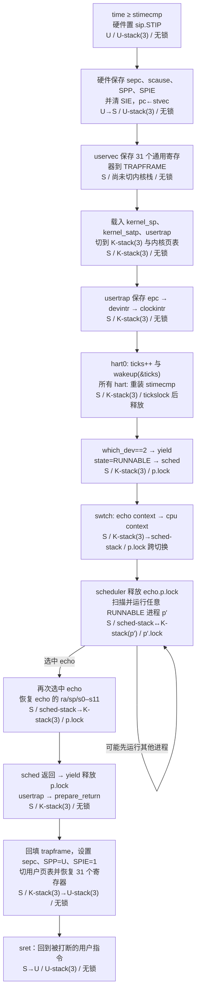

# 材料三：一次时钟中断的微观旅程

自时钟中断到达（`scause = 0x8000000000000005`）进入 `usertrap`，至 `sret` 返回用户态之间的全部动作，以及由此引发的 `yield()` 与调度决策。

**参考树**：`reference/xv6-riscv` HEAD `9e3161a`。
**被中断的进程**：echo（`pid 3`，`proc[2]`），正在用户态执行 `write(1,"hi",2)` 之前的某条指令。

---

## 前置：本版时钟中断没有 M 态参与

这是相对旧版 xv6 与绝大多数网络资料最大的一处结构性差异，必须先说清楚，否则整条时序会画错。

**旧版**：M 态 `timervec`（`kernelvec.S`）接管 CLINT 的 `mtimecmp` 中断，重新装填 `mtimecmp`，再通过 `sip.SSIP` 转发一个**软件中断**给 S 态；S 态看到的是 `scause = 0x8000000000000001`。

**本版**：启动时在 M 态开启 **Sstc 扩展**（`start.c:timerinit`）：

```c
w_menvcfg(r_menvcfg() | MENVCFG_STCE);   // 允许 S 态使用 stimecmp
w_mcounteren(r_mcounteren() | 2);        // 允许 S 态读 time
w_stimecmp(r_time() + 1000000);          // 装填第一次
```

此后 `time >= stimecmp` 时硬件**直接**向 S 态投递时钟中断，`scause = 0x8000000000000005`（S 态时钟中断）。M 态全程不参与，`timervec` 与 `mtimecmp` 均已不存在。重新装填由 S 态的 `clockintr()` 自己完成：

```c
w_stimecmp(r_time() + 1000000);   // trap.c:179，约 0.1 秒
```

**写 `stimecmp` 同时也就清除了本次中断请求**——这是它必须被执行的原因，漏掉它中断会持续挂起。

`start.c` 还做了两件与之相关的事：`w_mideleg(0xffff)` 把中断委派给 S 态；`w_sie(r_sie() | SIE_SEIE | SIE_STIE)` 打开 S 态的外部中断与时钟中断使能位。

---

## 时序阶段表

| # | 动作 | 执行者 | 栈 | 特权级 | 持锁 |
| --- | --- | --- | --- | --- | --- |
| 0 | `time` 计数到达 `stimecmp`，硬件置 `sip.STIP` | HW | U-stack(3) | U | — |
| 1 | 中断被接受：`sepc ← pc`；`scause ← 0x8000000000000005`；`sstatus.SPP ← 0`；`sstatus.SPIE ← sstatus.SIE`；`sstatus.SIE ← 0`；`pc ← stvec` | HW | U-stack(3) | U→S | — |
| 2 | `uservec`：`csrw sscratch,a0`；`li a0,TRAPFRAME`；`sd` 31 个通用寄存器；`csrr t0,sscratch; sd t0,112(a0)` 补存用户 `a0` | SW | 尚无内核栈 | S | — |
| 3 | 装载内核运行环境：`ld sp,8(a0)`；`ld tp,32(a0)`；`ld t0,16(a0)`；`ld t1,0(a0)`；`sfence.vma` → `csrw satp,t1` → `sfence.vma`；`jalr t0` | SW | → K-stack(3) | S | — |
| 4 | `usertrap()`：断言 `SPP == 0`；`w_stvec(kernelvec)` | SW | K-stack(3) | S | — |
| 5 | `p->trapframe->epc = r_sepc()` —— 把返回地址落到内存 | SW | K-stack(3) | S | — |
| 6 | `scause != 8`，进入 `devintr()` | SW | K-stack(3) | S | — |
| 7 | `devintr()` 匹配 `0x8000000000000005` → 调 `clockintr()`，返回 **2** | SW | K-stack(3) | S | — |
| 8 | `clockintr()`：仅 `cpuid() == 0` 的核执行 `acquire(&tickslock); ticks++; wakeup(&ticks); release(&tickslock)` | SW | K-stack(3) | S | `tickslock` |
| 9 | `clockintr()`：**所有核**执行 `w_stimecmp(r_time() + 1000000)`，装填下一次并清除本次请求 | SW | K-stack(3) | S | — |
| 10 | 回到 `usertrap`：`killed(p)` 为假，跳过 `kexit` | SW | K-stack(3) | S | — |
| 11 | `which_dev == 2` → `yield()` | SW | K-stack(3) | S | — |
| 12 | `yield()`：`acquire(&p->lock)`；`p->state = RUNNABLE`；`sched()` | SW | K-stack(3) | S | `p->lock` |
| 13 | `sched()` 四项断言：持有 `p->lock`、`noff == 1`、`state != RUNNING`、`intr_get() == 0`；保存 `intena` | SW | K-stack(3) | S | `p->lock` |
| 14 | `swtch(&p->context, &mycpu()->context)`：存 `ra`+`sp`+`s0–s11` 到 `p->context`，从 `cpu->context` 载入 | SW | K-stack(3) → sched-stack | S | `p->lock` **跨 swtch 持有** |
| 15 | 回到 `scheduler()` 的 `swtch` 之后：`mycpu()->intena = 0`；`c->proc = 0`；`found = 1`；`release(&p->lock)` | SW | sched-stack | S | 释放 `p->lock` |
| 16 | 继续扫描 `proc[]`；每轮循环顶部 `intr_on(); intr_off();`；若整轮无 `RUNNABLE` 则 `wfi` | SW | sched-stack | S | 逐个 `p->lock` |
| 17 | `scheduler()` 选中某个 `RUNNABLE` 进程 `p'`——**未必是 echo**：`p'->state = RUNNING`；`c->proc = p'`；`swtch(&c->context, &p'->context)` | SW | sched-stack → K-stack(p') | S | `p'->lock` |
| 18 | `p'` **从它自己上次 `swtch` 保存的位置**继续，未必是 `yield()`（见下表）；由 `p'` 侧代码 `release(&p'->lock)` | SW | K-stack(p') | S | 释放 `p'->lock` |
| 19 | 本核可如此往复运行任意多个进程。echo 此刻是 `RUNNABLE`，静候被再次选中——多核下也可能由**另一个核**的 `scheduler()` 选中 | SW | — | S | — |
| 20 | `scheduler()` 再次选中 echo：`p->state = RUNNING`；`c->proc = p`；`swtch(&c->context, &p->context)` | SW | sched-stack → K-stack(3) | S | `p->lock` |
| 21 | echo 的 `sched()` **从第 14 步那条 `swtch` 处返回**：`mycpu()->intena = intena` | SW | K-stack(3) | S | `p->lock` |
| 22 | 返回 `yield()`：`release(&p->lock)` | SW | K-stack(3) | S | 释放 `p->lock` |
| 23 | `yield()` 返回 `usertrap()`；调 `prepare_return()` | SW | K-stack(3) | S | — |
| 24 | `prepare_return()`：`intr_off()`；`w_stvec(TRAMPOLINE + (uservec-trampoline))`；回填 `kernel_satp`/`kernel_sp`/`kernel_trap`/`kernel_hartid` | SW | K-stack(3) | S | — |
| 25 | `prepare_return()`：`sstatus.SPP ← 0`；`sstatus.SPIE ← 1`；`w_sepc(p->trapframe->epc)` | SW | K-stack(3) | S | — |
| 26 | `usertrap()` `return MAKE_SATP(p->pagetable)` —— 返回值经 `a0` 传出，控制流**落入** `trampoline.S:userret` | SW | K-stack(3) | S | — |
| 27 | `userret`：`fence.i`；`sfence.vma` → `csrw satp,a0` → `sfence.vma`；`li a0,TRAPFRAME`；`ld` 恢复 31 个寄存器；最后 `ld a0,112(a0)` | SW | → U-stack(3) | S | — |
| 28 | `sret`：`pc ← sepc`；`sstatus.SIE ← sstatus.SPIE`（重开中断）；特权级 ← `sstatus.SPP`（= U）。echo 从被时钟中断打断的那条指令继续 | HW | U-stack(3) | S→U | — |

> **第 17–20 步是本流程最容易画错的地方。** `scheduler()` 只是遍历 `proc[]` 找任意一个 `RUNNABLE` 就 `swtch` 过去（`proc.c:445–453`），它**并不知道**也不关心谁是"刚才让出 CPU 的那个"。被选中的 `p'` 恢复执行的位置，取决于 `p'` **自己**上一次是在哪里调用 `swtch` 的：
>
> | `p'` 上次停在哪 | `swtch` 返回后从哪继续 |
> | --- | --- |
> | `yield()` → `sched()` | 回 `yield()`，与本表第 21–23 步同形 |
> | `sleep()` → `sched()`（`proc.c:570`） | 回 `sleep()`，`release(&p->lock)` 后返回给 `consoleread` / `kwait` / `uartwrite` 等调用方 |
> | 首次被调度（`context.ra = forkret`） | 进 `forkret()`，走它自己的 `prepare_return()` + 手动跳 `userret` |
> | `kexit()` → `sched()` | **不返回**，该进程已是 `ZOMBIE` |
>
> 换句话说：**上下文切换不是"调度器选谁、谁就回到 `usertrap`"，而是每个进程各自从它上一次 `swtch` 保存的 `ra`/`sp` 处继续。** 本材料追踪的是 echo 这一个进程，所以第 19 步之后必须等 `scheduler()` **再次选中 echo**，控制流才回到第 14 步那条 `swtch` 的返回点，进而回到 `yield()` → `usertrap()`。中间隔了多久、跑过哪些进程，都不确定。

> **注意第 26 步**：本版 `usertrap()` 的返回类型是 `uint64`，返回的是用户 satp。`uservec` 中调用它的指令是 `jalr t0`，其返回地址正是紧随其后的 `userret` 第一条指令，因此 `usertrap` 一返回就**自然落入** `userret`，`a0` 里恰好是 satp。旧版是 `usertrapret()` 在函数内部计算好 satp 后用函数指针显式跳转到 `userret`，两者到达同一个地方，但调用形态不同——画图时不能照抄旧版。

---

## 三个必须讲清的点

### ① 寄存器现场保护

**保存在 trapframe，而不是内核栈。** 原因是第 2 步执行时**还没有内核栈可用**：`sp` 仍指向用户栈，而内核栈的地址存在 `p->trapframe->kernel_sp` 里，要先读出来才能用。若把寄存器压在用户栈上，用户程序可以随意篡改自己的栈，内核恢复出来的现场就不可信；而 trapframe 页在用户页表里是 `PTE_U = 0` 的，用户碰不到。

trapframe 因此必须满足两个条件：在换页表**之前**就能访问（所以映射在用户页表里），且在每个进程的用户页表中位于**同一个虚拟地址** `TRAPFRAME`（所以 `uservec` 可以直接 `li a0, TRAPFRAME` 硬编码，不需要知道自己是哪个进程）。

trapframe 除 32 个通用寄存器外还有 5 个字段（`proc.h:41–45`），全部由 `prepare_return()` 在**上一次返回用户态时**预先填好，供**下一次**陷入时使用：

| 字段 | 偏移 | 用途 |
| --- | --- | --- |
| `kernel_satp` | 0 | 内核页表，第 3 步 `csrw satp` 用 |
| `kernel_sp` | 8 | `p->kstack + PGSIZE`，内核栈顶 |
| `kernel_trap` | 16 | `usertrap` 的地址，`jalr` 的目标 |
| `epc` | 24 | 保存的用户 `pc` |
| `kernel_hartid` | 32 | 恢复 `tp`，供 `cpuid()` 使用 |

浮点寄存器不保存——xv6 内核不使用浮点，用户程序也未启用 F/D 扩展。

### ② 调度器交接

`swtch` 只处理 `struct context` 的 14 个字段（`ra`、`sp`、`s0–s11`），够用的原因是 `swtch` 以**普通 C 函数**的形式被调用：RISC-V 调用约定规定 caller-saved 寄存器（`t0–t6`、`a0–a7`）由调用方在调用点自行保存，编译器已经在 `sched()` 里生成了相应代码。`swtch` 只需负责 callee-saved 部分，加上 `sp`（换栈）与 `ra`（换返回点）。

换句话说：**trapframe 保存的是"用户线程的全部状态"，context 保存的是"内核线程在一次函数调用边界上的状态"**，两者层次不同，字段数量差异正源于此。

**`p->lock` 的不变式**：谁调用 `sched()`，谁就必须已经持有 `p->lock`、且**只**持有这一把锁（`sched()` 开头的 `noff == 1` 断言就是在查这件事），并且已经把 `p->state` 改成了非 `RUNNING` 的目标状态。锁不由调用方释放，而是跨过 `swtch` 交给**对方**：

- 进程 → 调度器：`yield()` 持锁 `swtch` 出去，由 `scheduler()` 在第 15 步 `release(&p->lock)`
- 调度器 → 进程：`scheduler()` 持锁 `swtch` 进去，由进程侧的 `yield()`/`sleep()`/`forkret()` 释放

这条不变式保护的窗口是"`state` 已改成 `RUNNABLE`、但寄存器现场还没存进 `p->context`"这段时间。如果此刻放锁，另一个核的 `scheduler()` 就可能看到这个 `RUNNABLE` 进程并把它调走，而它的 `sp` 还指向本核正在使用的内核栈——两个核同时跑同一个内核栈。

> 💭 第 15 步的 `mycpu()->intena = 0` 是旧版没有的。`intena` 记录"进入最外层临界区前中断是否开着"，由 `push_off`/`pop_off` 维护，它是**内核线程**的属性而非 CPU 的属性（`sched()` 上方的注释明说了这点）。刚 `swtch` 回调度器时，`intena` 里残留的是刚才那个进程线程的值；若不清零，紧接着的 `release(&p->lock)` 可能据此把中断打开，而调度器随后要执行 `wfi`，中断状态就乱了。这是"锁的状态属于线程还是属于 CPU"这个问题在代码里留下的痕迹。

### ③ `sret` 恢复

**为什么中断路径不给 `epc` 加 4，而系统调用路径要加？** RISC-V 规定：`ecall` 是同步异常，`sepc` 指向 `ecall` **这条指令本身**，若直接返回会无限重入同一次系统调用，所以 `usertrap` 里显式 `p->trapframe->epc += 4`（`trap.c:62`）。中断是异步的，`sepc` 指向**尚未执行**的那条指令，直接返回即从它继续，加 4 反而会跳过一条真实指令。

> 这条差异就是调试手册 §六"系统调用陷入死循环无限重入 → 查 `sepc` 是否 +4"那一行的由来。

**为什么 `prepare_return()` 一开始就 `intr_off()`？** 它随后要把 `stvec` 从 `kernelvec` 改回 `uservec`。改完到 `sret` 之间 CPU 仍在 S 态，若此时来一个中断，硬件会跳到 `uservec`——而 `uservec` 的第一件事是 `li a0, TRAPFRAME` 并往里写寄存器，此刻用的却还是内核页表，`TRAPFRAME` 在内核页表中并无映射，立刻二次异常。中断在第 28 步由 `sret` 依据 `SPIE` 自动重新打开，窗口精确闭合。

**若 `stvec` 忘了改回 `uservec`**：用户态下一次陷入会跳进 `kernelvec` → `kerneltrap()`，而它的第一个断言就是 `if((sstatus & SSTATUS_SPP) == 0) panic("kerneltrap: not from supervisor mode")`——来自用户态的陷入 `SPP` 为 0，直接 panic。

---

## 内核态被时钟中断打断的情形

若中断到达时 CPU 正在内核态执行（例如 sh 正在 `kwait` 的扫描循环里），路径不同：

| 差异点 | 用户态被中断 | 内核态被中断 |
| --- | --- | --- |
| 入口 | `stvec` = `uservec`（trampoline） | `stvec` = `kernelvec` |
| 现场保存位置 | trapframe | **当前内核栈**（`kernelvec.S` 压 caller-saved 寄存器） |
| 处理函数 | `usertrap()` | `kerneltrap()` |
| 是否换页表 | 换（用户表 → 内核表） | 不换，本来就是内核表 |
| `yield` 条件 | `which_dev == 2` | `which_dev == 2 && myproc() != 0` |
| 返回前 | `prepare_return()` + `userret` + `sret` | `w_sepc(sepc); w_sstatus(sstatus)` 后由 `kernelvec` 弹栈 `sret` |

`kerneltrap()` 末尾那两句手动回写（`trap.c:162–163`）带着注释 `the yield() may have caused some traps to occur`：`yield()` 期间本核会去跑别的进程，那些进程自己的陷入会覆盖 `sepc`/`sstatus`，所以必须在函数入口就把这两个 CSR 存进局部变量，返回前再写回去。

`kerneltrap()` 还断言 `intr_get() != 0` 即 panic——内核态的中断必须是在中断关闭状态下被处理的，因为进入 trap 时硬件已经把 `SIE` 清零了。

---

## 与后续实验的对应

本条路径在 **lab2（陷入、系统调用与控制台驱动）** 由本人实现；`yield()` 与调度决策属于 **lab4（进程状态机与调度器）**。

调试时 `-d int` 日志中每 tick 一条 `0x8000000000000005` 属正常输出，需用 `grep 'async:0'` 过滤后才能看见真正的异常，见 [`docs/07-无gdb调试手册.md`](../../docs/07-无gdb调试手册.md)。

---

## 时钟中断时序图



> 💭 **手绘复核点**：本参考树使用 Sstc，时钟中断直接进入 S 态，没有旧版 `timervec` 的 M 态转发；中断路径不对 `epc` 加 4；调度器可能先运行任意其他进程，只有再次选中 echo 后才会从它自己的 `swtch` 返回点继续。
