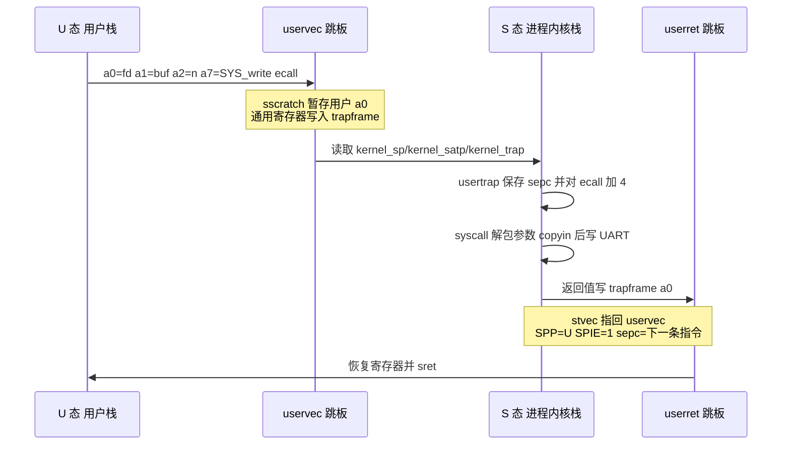

# lab2 设计与验收问答

本文按 Lab2 V2 实验说明书的四个阶段、三道思考题和增量包列出的五项设计决策组织。任务书原题保留独立题号，便于现场抽题后直接定位；实现细节以当前个性化内核为准，不把 MIT xv6 的完整进程模型误当成本实验已经具备的能力。

## 目录

- [0 个性化参数速查](#0-个性化参数速查)
- [1 系统主线与四阶段能力](#1-系统主线与四阶段能力)
- [2 两条完整控制流](#2-两条完整控制流)
- [3 V2 思考题完整回答](#3-v2-思考题完整回答)
  - [3.1 ecall 与 sret 的硬件软件分工](#31-ecall-与-sret-的硬件软件分工)
  - [3.2 sepc 在系统调用与中断中的处理差别](#32-sepc-在系统调用与中断中的处理差别)
  - [3.3 行缓冲与字符流语义](#33-行缓冲与字符流语义)
- [4 增量包设计决策](#4-增量包设计决策)
- [5 现场三题速答](#5-现场三题速答)
- [6 高频追问与可能问题](#6-高频追问与可能问题)
- [7 故障现象与日志定位](#7-故障现象与日志定位)

建议先记住第 0、1 节中的个人参数和主链路，再熟练复述第 3 节三道原题。第 4 节用于回答“为什么这样设计”，第 6、7 节用于应对实现追问和现场故障定位。

## 0 个性化参数速查

| 项目 | 当前值 | 实现影响 |
| --- | ---: | --- |
| 学号 | `2024302141121` | 个性化参数唯一来源为 `course_sid.h` |
| `LAB2_TICK` | 3 | M 态定时器间隔为 `100000 × 3` 个 timebase 单位 |
| `LAB2_BUF_SEMANTICS` | 1 | 字符流：字符到达即可使单字节读取继续 |
| `LAB2_BUF_SIZE` | 64 | UART 接收环形缓冲区容量为 64 字节 |
| 用户映像空间 | 64 KiB | 每进程独立，包含程序数据与向下增长的用户栈 |
| 每进程内核栈 | 8 KiB | trap 后切换到当前进程自己的内核栈 |
| 最大进程槽位 | 8 | 静态槽位，满足本轮 Shell 的单子进程顺序执行 |
| 未知系统调用错误码 | `-1` | 不 panic，不越界访问分发表 |

## 1 系统主线与四阶段能力

~~~text
M 态 _entry/start
  ├─ 保留 Lab1 的 PMP、UART 输出和 Banner
  ├─ 配置 CLINT M 态定时器与 timervec
  └─ mret → S 态 main
       ├─ vm_init：最小内核/用户/跳板映射
       ├─ trap_init：kernelvec、PLIC、UART、SSIP/SEIE
       ├─ proc_init：从 _uprog_table 装入 sh
       └─ usertrapret → userret → sret → U 态 sh
            ├─ read：UART 中断输入
            ├─ write/getpid：基础系统调用
            └─ fork → child exec → exit → parent wait 返回
~~~

V2 说明书的四阶段与当前代码对应如下：

| 阶段 | 任务书目标 | 当前实现位置 | 验证现象 |
| --- | --- | --- | --- |
| 一 | uservec/usertrap/usertrapret/userret 往返 | `trampoline.S`、`trap.c`、`proc.h` | 能从 U 态 ecall 后返回下一条指令 |
| 二 | getpid、write、exit 与非法编号容错 | `syscall.c` | `hi` 输出 PID，`badecall` PASS |
| 三 | PLIC、UART 中断和环形输入缓冲 | `trap.c`、`console.c` | 输入回显，`bufstorm` 四行完成 |
| 四 | `_uprog_table` 装载 Shell 和子程序 | `proc.c`、生成的 `userimg.S` | 出现 `sh>`，可执行 `hi/spin` |

当前实现额外补齐了增量包明确要求的最小 `fork/wait/exec/exit` 状态闭环，但没有提前实现 Lab4 的通用抢占调度器。

## 2 两条完整控制流

### 2.1 一次 write 系统调用往返

调用桩由只读 `user/usys.pl` 生成。它把系统调用号放进 `a7`，参数按 RISC-V ABI 位于 `a0-a2`。硬件执行 ecall 后不保存通用寄存器、不换栈，实际保存工作由 `uservec` 完成。`usertrap()` 在 `kernel/trap.c:79` 保存 `sepc`，仅对 cause 8 推进 4 字节；`syscall()` 在 `kernel/syscall.c:96` 写回 `a0`；`usertrapret()` 在 `kernel/trap.c:119` 准备返回环境。

### 2.2 一次键盘中断路径

`trap_init()` 在 `kernel/trap.c:62` 接通 PLIC、UART IER 和 S 态外部中断；生产者 `console_intr()` 位于 `kernel/console.c:98`；消费者 `console_read()` 位于 `kernel/console.c:125`。当前尚无 Lab4 的 sleep/wakeup 队列，空缓冲时临时打开中断并执行 `wfi`，有字符后在同一当前进程中继续。

## 3 V2 思考题完整回答

### 3.1 ecall 与 sret 的硬件软件分工

> **原题 1：ecall 与 sret 执行时硬件各做了什么？RISC-V 为什么不在硬件层面自动保存通用寄存器、切换栈？**

**结论：** 从 U 态执行 ecall 时，硬件记录异常原因和返回位置、切换到 S 态并跳到 `stvec`；它不会保存通用寄存器，也不会自动把用户栈换成内核栈。sret 根据 `sstatus.SPP` 恢复目标特权级，把 `pc` 设为 `sepc`，并按 `SPIE` 恢复中断使能状态；通用寄存器和栈同样由软件事先准备。

ecall 的关键硬件动作可概括为：

1. `sepc ← ecall` 指令地址。
2. `scause ← 8`，表示 U 态环境调用。
3. `sstatus.SPP ← U`，`SPIE ← 原 SIE`，并清除 SIE。
4. 当前特权级切换为 S，`pc ← stvec`。

随后软件必须完成：暂存用户 `a0`、保存通用寄存器到 trapframe、取得可信内核栈和内核页表、进入 C 语言分发函数。当前只读 `trampoline.S` 用 `sscratch` 暂存用户 `a0`，再从 trapframe 头部取出 `kernel_sp`、`kernel_trap`、`kernel_satp` 和 `kernel_hartid`。

sret 本身不会“神奇恢复整个进程”。在执行它之前，`usertrapret()` 已经设置 `stvec`、`sstatus`、`sepc` 和 trapframe 环境；`userret` 已恢复通用寄存器。sret 最终只完成特权级、中断状态和 PC 的硬件恢复。

RISC-V 不规定硬件自动保存全部寄存器和切栈，是为了保持 trap 入口机制简单，并把策略交给操作系统：有的异常只需保存少量寄存器，有的系统使用每核栈，有的使用每进程栈；强制硬件保存固定大现场会增加延迟和实现复杂度，也无法适应不同内核的内存布局。

**可能追问：为什么 trampoline 必须用汇编？**

答：刚进入 trap 时没有可信 C 栈，编译器生成的函数序言会立即使用 `sp`，而此时 `sp` 仍是用户值。汇编必须先在不依赖栈和未保存寄存器的条件下建立可运行环境。

### 3.2 sepc 在系统调用与中断中的处理差别

> **原题 2：处理系统调用时要对 sepc 做什么处理？为什么？时钟中断的处理需要对 sepc 做同样的处理吗？为什么？**

**结论：** ecall 的 `sepc` 指向 ecall 指令自身，所以系统调用分支必须执行 `sepc += 4`；时钟或 UART 中断不能加 4，因为异步中断发生在指令边界，`sepc` 表示中断后应继续执行的位置，额外前移会跳过一条正常用户指令。

RISC-V 当前实验使用的 ecall 是固定 4 字节指令。如果不推进 `sepc`，sret 后再次执行同一条 ecall，于是形成“陷入—返回—再次陷入”的死循环；`write` 的典型表现是同一段输出反复出现。推进动作应在允许中断或执行可能切换进程的系统调用之前完成，使 trapframe 始终保存可恢复的下一条 PC。

中断与异常的语义不同：ecall 是当前指令主动产生的同步异常，这条指令已经完成了“进入内核”的作用，返回时应越过它；时钟和 UART 是外部异步事件，被打断的正常指令并不是错误来源，硬件给出的 `sepc` 已是正确恢复点。当前 `device_interrupt()` 只处理设备并重装定时器，不修改用户 `epc`。

**可能追问：非法指令是否也统一加 4？**

答：不能。非法指令、访问越界等异常必须先按策略终止进程或修复原因；盲目跳过可能掩盖错误并继续执行损坏状态。本轮对非 ecall、非已知中断打印 `scause/sepc/stval` 后停机保留现场。

### 3.3 行缓冲与字符流语义

> **原题 3：行缓冲与字符流两种语义，在中断处理和读取函数里各造成什么差别？如果只改一处，例如只在中断里改唤醒条件，会出什么问题？**

**结论：** 行缓冲以换行为可见记录边界，读者应在一行完成后继续；字符流允许每个字符到达后立即让读者继续。生产者的通知条件和消费者的返回条件必须表达同一种语义，只改一侧会产生不必要等待、短读失控或唤醒后再次睡眠。

| 位置 | 行缓冲 `SEMANTICS=0` | 字符流 `SEMANTICS=1` |
| --- | --- | --- |
| UART 中断生产者 | 普通字符只入队，换行后才使整行可读 | 每个字符入队后即可使单字节读继续 |
| `read` 消费者 | 通常读到换行、长度上限或 EOF 才返回 | 可在取得至少一个字符后返回，允许短读 |
| 空缓冲等待 | 等待一行完成条件 | 等待任一字符条件 |

本人的参数是字符流 1。Shell 的 `gets()` 每次调用 `read(..., 1)`，所以单个字符到达即可返回；`bufstorm` 一次请求 256 字节，当前实现仍收集到换行为止，保留命令和测试所需的记录边界。这是“字符到达即可进展”与“多字节读取不拆散一行”的折中，不影响单字节字符流语义。

只修改生产者唤醒条件而不修改消费者，可能出现“每个字符都触发进展，但消费者醒来后仍坚持等换行”，造成大量无效唤醒；只修改消费者使其按字符返回，而生产者仍只在换行时通知，则字符已经在缓冲区里，读者却一直睡到回车。虽然当前 Lab2 用 `wfi` 而非正式等待队列，这个一致性原则仍决定何时退出等待循环、何时从 `read` 返回。

## 4 增量包设计决策

### 4.1 trapframe 放在哪里，由谁切换

每个进程拥有独立的一页 trapframe，所有用户页表都把自己的 trapframe 映射到相同虚拟地址 `TRAPFRAME`。`struct trapframe` 的前五项依次是 `kernel_satp`、`kernel_sp`、`kernel_trap`、`epc`、`kernel_hartid`，随后从偏移 40 开始排列通用寄存器。编译期断言固定 `a0=112`、`t6=280`，防止 C 布局与预置汇编错位。

进入用户态前，`usertrapret()` 根据当前进程填入内核运行环境；发生 trap 后，`uservec` 用固定偏移保存现场并切换到该进程内核栈。`fork` 复制父进程 trapframe，再把子进程的 `a0` 改为 0；父进程从 fork 得到子 PID。

> 💭 V2 文档允许使用 Bare 作为过渡，但预置 `trampoline.S` 固定访问高地址 `TRAPFRAME`，用户程序又从地址 0 链接。QEMU 的物理 RAM 不包含这两个裸地址，因此当前实现只建立满足用户低地址、trapframe 和 trampoline 的最小静态 SV39 映射，没有提前实现 Lab3 的通用页表分配器。

### 4.2 输入缓冲、并发保护和溢出策略

缓冲区使用单调递增的 `read_index` 与 `write_index`，元素数恒为无符号差值 `write_index - read_index`，物理槽位才对 `LAB2_BUF_SIZE=64` 取模。生产者和消费者都运行在单核上；访问共享下标时中断关闭，因此本轮不额外引入自旋锁。

缓冲未满时写入并递增 `write_index`；满时丢弃普通新字符并累计 `dropped`。换行是恢复例外：如果超长行已经填满缓冲，换行会替换最后一个未读数据字节，保证消费者最终遇到记录边界，不会永远等待一个已经被丢弃的回车。

> 💭 最初严格采用“满时丢弃所有新字符”，100 字节压力测试使换行也被丢弃，`bufstorm` 永久等待。保留换行仍允许丢弃溢出数据，同时给读取路径保留可证明的终止条件。

空缓冲时，本轮没有真正的 sleep/wakeup，`console_read()` 临时打开中断并执行 `wfi`。Lab4 应把它替换成带锁的“检查条件—进入睡眠队列—原子释放锁”流程，避免丢失唤醒并允许其他进程运行。

### 4.3 系统调用分发表和错误码

分发器采用显式 `switch`。优点是本轮只实现需要的调用时边界清晰，未知编号自然落入 `default`；代价是系统调用增多后不如函数指针表紧凑。所有未知或未实现编号统一返回 `-1`，`badecall` 用 90–99 验证不会越界或 panic。

参数来自当前进程 trapframe 的 `a0-a5`，调用号来自 `a7`，返回值写回 `a0`。分发器先保存 `caller`；因为 `exit` 和等待中的 `wait` 会切换当前进程，只有 `myproc() == caller` 时才向原调用者写返回值。

> 💭 如果分发器在 `sys_exit()` 后无条件执行 `myproc()->trapframe->a0 = result`，此时 `myproc()` 已经是被唤醒的父进程，子进程的返回值会污染父进程的 wait 结果。保存调用者身份并在写回前核对，是进程切换路径的必要不变式。

### 4.4 没有通用页分配器时如何 fork

本轮预留 8 个静态进程槽，每槽有独立 64 KiB 用户映像、trapframe、页表和 8 KiB 内核栈。`fork` 找到空槽后复制完整用户映像和 trapframe，子进程状态设为 RUNNABLE，父子内存立即独立，不存在共享写入。

Shell 随后调用 `wait`，当前最小状态机把父进程置为 WAITING 并切到其 RUNNABLE 子进程；子进程 `exec` 替换映像，`exit` 时恢复等待父进程并把 PID 写回父 trapframe。该方案足以支撑本轮 `sh → hi/spin`，但没有通用调度、公平性、僵尸链表或孤儿收养，Lab4 必须重构。

### 4.5 exec 与内嵌程序表

构建系统生成的 `_uprog_table` 每项依次为 `u64 start`、`u64 end`、以 NUL 结束的名字，并按 8 字节对齐，最后由 `{0,0}` 结束。`proc_exec()` 去掉 Shell 输入中的换行，按名字遍历表，检查映像大小后清空当前 64 KiB 用户区并复制平铺二进制，将 `epc=0`、`sp=64 KiB-16`。

用户栈从高地址向下增长，初始 `sp` 保持 16 字节对齐。Lab2 允许忽略 argv，所以当前 exec 只使用程序名；Lab5 再补全参数字符串复制和栈布局。

### 4.6 用户指针如何处理

虽然增量包允许直接映射阶段直接解引用，当前实现仍通过 `proc_copyin`、`proc_copyout` 和 `proc_copyinstr` 检查地址及长度是否落在本进程 64 KiB 用户区，再转换到对应物理存储。这样非法长度不会直接使内核越界。Lab3 后应改成逐页 walk，并检查 PTE 的有效位、用户位和读写权限。

### 4.7 定时器兼容路径

当前 QEMU CPU 不实现 Sstc，直接访问 `menvcfg` 会产生 cause 2 非法指令。`start()` 因此配置 CLINT M 态定时器；`timervec.S` 重装 `mtimecmp` 并置位 `sip.SSIP`；S 态 trap 将 cause 1 计为 tick 并清除 SSIP。`LAB2_TICK=3` 直接参与比较间隔计算。

## 5 现场三题速答

### 5.1 机理题

ecall 只负责记录 `sepc/scause`、切到 S 态并跳到 `stvec`，不保存通用寄存器、不切栈；软件 trampoline 保存 trapframe、换内核栈和页表。sret 只根据 `SPP/SPIE/sepc` 恢复特权级、中断状态和 PC，通用寄存器已由 `userret` 先恢复。

### 5.2 个性化题

本人的 `LAB2_BUF_SIZE=64`、`LAB2_BUF_SEMANTICS=1`、`LAB2_TICK=3`。输入采用单调下标环形缓冲；满时丢普通字符但保留换行终止边界；单字节 read 按字符流立即返回。

### 5.3 定位题

若 write 反复输出同一串，先检查 ecall 分支是否把 `sepc` 加 4。若敲键盘无响应，按 UART IER → PLIC priority/enable → `sie.SEIE` → `sstatus.SIE` 顺序核对。若一进用户态 cause 1/2，检查 trampoline 映射、程序映像地址、`epc` 和用户栈对齐。

## 6 高频追问与可能问题

### 6.1 trap 与 trampoline

**问：为什么 trapframe 字段顺序不能随便改？**

答：汇编只认识固定数字偏移，例如 `sd a0,112(a0)`。字段漏失或顺序变化会使 C 与汇编把同一地址解释成不同寄存器，恢复现场立即损坏。

**问：sscratch 在本实现中做什么？**

答：刚进入 uservec 时所有通用寄存器都属于用户，汇编需要一个临时位置保存用户 `a0`，才能把 `a0` 改成 trapframe 基址。保存其他寄存器后再从 `sscratch` 取回原用户 `a0` 写入偏移 112。

**问：为什么用户态和内核态要使用不同 stvec？**

答：用户态 trap 必须先经过 uservec 保存用户现场并换栈；内核执行系统调用时若再次收到中断，已经位于可信内核栈，应进入 kernelvec 保存内核寄存器。若仍指向 uservec，会把内核现场误当作用户现场。

**问：为什么 trampoline 在用户页表和内核页表中必须位于同一虚拟地址？**

答：uservec/userret 会在执行过程中切换 `satp`。切换后的下一条取指仍使用当前 PC；只有两张页表把该虚拟页映射到同一物理代码页，执行流才能连续。

**问：Makefile 为什么重命名目标文件的 trampsec？**

答：Lab1 预置链接脚本只收纳 `.text/.text.*`，而预置 trampoline 使用独立 `trampsec`。不改两份只读源文件的前提下，构建时把目标段重命名为 `.text.trampoline`，使它进入可加载内核 text；否则链接器会把孤儿段放到地址 0，首次 userret 取指 cause 1。

### 6.2 系统调用与进程

**问：系统调用参数和返回值分别在哪里？**

答：调用号在 `a7`，前三个参数在 `a0-a2`，返回值写回 trapframe 的 `a0`。当前解包函数也支持读取到 `a5`。

**问：为什么未知调用不能直接索引函数表？**

答：未验证编号可能越界读取函数指针并跳到随机地址。无论 switch 还是表驱动，都必须先检查范围和空项；当前 default 返回 `-1`。

**问：fork 后父子分别看到什么返回值？**

答：父进程 syscall 返回新 PID；复制 trapframe 后显式把子进程 `a0` 设为 0，所以子进程从同一 fork 返回点继续时看到 0。

**问：为什么 spin 运行后 Shell 不能继续执行下一条命令？**

答：Shell fork 后立即 wait，而 spin 不 exit；Lab2 只要求忙程序运行时中断仍可响应，不要求并发交互式作业控制。通用抢占调度和可运行队列属于 Lab4。

**问：当前实现支持 22 个系统调用吗？**

答：接口号 1–22 都由预置文件定义，但本轮只实现 Shell 和测试所需的 fork、exit、wait、read、exec、getpid、pause、uptime、write；其余确定返回 `-1`，不谎称已具备文件系统能力。

### 6.3 控制台与中断

**问：环形缓冲为什么用单调递增下标而不是每次手动回绕？**

答：`write-read` 直接表达元素数，空是相等，满是差值等于容量；实际数组访问再取模。无符号回绕下差值在容量远小于计数范围时仍成立。

**问：缓冲满时为什么不在中断处理里等待？**

答：中断处理不能等待消费者，否则消费者只有等中断返回后才可能运行，会形成死锁。本轮丢弃溢出字符，并保留换行作为恢复边界。

**问：PLIC claim 后为什么必须 complete？**

答：claim 取得并占有当前最高优先级 IRQ；处理后把同一编号写回 claim/complete 寄存器，PLIC 才会结束该次服务并允许后续同源中断。

**问：为什么 console_read 等待时可以打开中断？**

答：它已经把 `stvec` 切到 kernelvec，并运行在可信内核栈；打开 SIE 后 UART 中断可入队字符，kernelvec 恢复后 `wfi` 返回，读取循环重新检查条件。

### 6.4 装载与地址空间

**问：加载地址如何避免覆盖内核？**

答：用户映像不复制到 `kernel_end` 后任意裸地址，而是复制到每进程预留的独立物理数组，再由用户页表映射到虚拟地址 0，所以不会覆盖内核 text/data/bss。

**问：为什么用户入口 epc 是 0？**

答：预置 `user.ld` 把平铺程序从虚拟地址 0 链接，用户页表也把映像第一页映射到 VA 0；程序入口为 main，所以首次 sret 的 `sepc` 设为 0。

**问：为什么用户栈顶减 16？**

答：用户空间高端留给向下增长的栈，减 16 后仍满足 RISC-V ABI 的 16 字节对齐，并避免把初值放在映射边界之外。

## 7 故障现象与日志定位

| 症状 | 第一问题 | 重点检查 |
| --- | --- | --- |
| write 反复输出同一串 | 返回 PC 是否仍是 ecall | `sepc += 4` 是否只在 cause 8 分支 |
| 非法系统调用使内核崩溃 | default 去哪里、a0 写了什么 | 编号范围、统一 `-1` |
| 一进用户态 cause 1/2 | epc 和映射是否一致 | trampoline 物理页、程序 VA 0、用户栈 |
| 敲键盘无回显 | 中断使能链哪一环断了 | IER → PLIC → SEIE → SIE |
| 输入乱码或丢失 | 环形缓冲下标是否满足不变式 | 满/空条件、取模位置、中断保护 |
| 超长行后永久等待 | 换行是否随溢出数据被丢弃 | 满缓冲的记录边界恢复 |
| 启动在 `0x80000070` cause 2 | QEMU 是否支持 Sstc | 不访问 `menvcfg/stimecmp`，走 M timer 桥接 |
| userret 在高地址 cause 1 | trampoline 是否进入可加载段 | ELF section、页表 PTE_X、虚实地址偏移 |
| `spin` 时键盘完全无反应 | 用户态中断是否打开 | `SPIE`、SEIE、PLIC complete |

无 gdb 定位顺序：

~~~bash
qemu-system-riscv64 -machine virt -bios none \
  -kernel kernel/kernel -nographic -d int -D int.log

grep 'async:0' int.log | head
riscv64-unknown-elf-addr2line -e kernel/kernel <epc>
~~~

Lab2 的正常 U 态 ecall 也显示为 `async:0 cause=8`，所以“零同步异常”必须解释为排除 cause 8 后为 0；不能把正常系统调用误判为故障。
