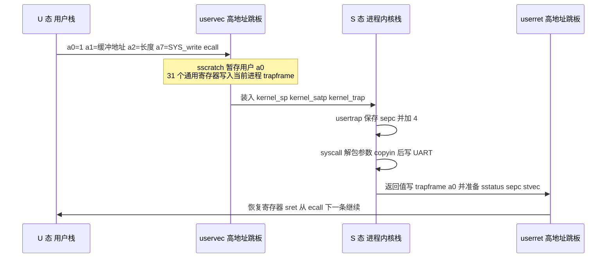
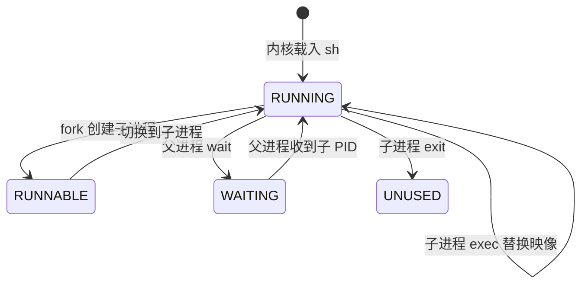

# lab2 设计与验收问答

## write 系统调用往返

实现依据：`kernel/trap.c:79` 保存用户现场对应的控制状态，`kernel/syscall.c:96` 分发调用并只在调用者仍为当前进程时写回 `a0`，`kernel/trap.c:119` 准备返回环境。`sepc += 4` 只用于 ecall；中断发生在两条指令之间，必须原地址恢复，不能同样加 4。

## UART 中断路径

使能链路位于 `kernel/trap.c:62`，生产者位于 `kernel/console.c:98`，消费者位于 `kernel/console.c:125`。当前阶段没有 Lab4 的阻塞队列，因此空缓冲时临时打开中断并执行 `wfi`；它不会忙占 CPU，但仍只有一个当前进程，Lab4 必须替换为真正的 sleep/wakeup。

## trapframe 与地址空间

`struct trapframe` 每个字段都是 8 字节，头五项依次是 `kernel_satp`、`kernel_sp`、`kernel_trap`、`epc`、`kernel_hartid`，随后从偏移 40 开始排列通用寄存器。编译期断言固定 `a0=112`、`t6=280`，防止 C 布局与预置汇编静默错位。

每个进程拥有独立的 trapframe 页、64 KiB 用户映像和 8 KiB 内核栈。`kernel/proc.c:116` 安装最小静态 SV39 映射：用户低地址映射自身映像，高地址只映射当前 trapframe 与只读跳板。完整的动态物理页分配、权限细分和受控页表复制留给 Lab3。

> 💭 说明书允许 Lab2 使用 Bare 地址转换，但预置 `trampoline.S` 固定访问高地址 `TRAPFRAME`，用户程序又从虚拟地址 0 链接；两者在 QEMU 物理内存布局下无法同时由 Bare 模式满足。因此这里使用最小静态页表完成接口闭合，而没有提前实现 Lab3 的通用页表管理器。

## 最小进程状态机

`kernel/proc.c:266` 复制父进程的用户映像与 trapframe；`kernel/proc.c:290` 在父进程 `wait` 时选择其可运行子进程；`kernel/proc.c:307` 在子进程退出时恢复等待中的父进程。这个状态机只覆盖课程包 Shell 的单子进程顺序执行，不宣称具备 Lab4 的抢占调度能力。

> 💭 `syscall()` 在调用处理函数前保存 `caller`。`exit` 和阻塞式 `wait` 会改变全局当前进程，分发器只有在 `myproc() == caller` 时才写回返回值，否则会把子进程结果错误写进父进程或反过来。

## 输入缓冲不变式

环形缓冲使用单调递增的 `read_index` 与 `write_index`，元素数恒为无符号差值 `write_index - read_index`，物理槽位才对 64 取模。缓冲未满时写入并递增 `write_index`；满时丢弃普通新字符。

换行是唯一例外：若超长行已填满缓冲，接收到换行时用它替换最后一个尚未读取的数据字节。这样仍然丢弃溢出数据，但保留记录边界，避免消费者永远等待已被丢弃的换行。该分支可在 `kernel/console.c:98` 追溯。

> 💭 单纯采用“满时丢弃所有新字符”会把行结束符一起丢掉。第一次 100 字节压力测试确实复现了 `bufstorm` 永久等待；保留换行是从故障现象推导出的恢复不变式，不是为了隐藏丢字。

## 系统调用与错误路径

分发器使用显式 `switch`，只实现 Lab2 实际需要的九个调用。未实现编号和 90–99 的非法编号都落入 `default` 并返回 `-1`，内核不 panic。用户指针先通过 `proc_copyin`、`proc_copyout` 或 `proc_copyinstr` 做 64 KiB 边界检查；Lab3 启用通用页表后再替换为逐页 walk 的复制接口。

## 定时器兼容路径

当前 QEMU 不实现 Sstc，直接访问 `menvcfg` 会在 `0x80000070` 产生非法指令。`kernel/start.c:28` 因此配置 CLINT M 态定时器，`kernel/timervec.S:4` 重新装载比较值并置位 `sip.SSIP`，S 态再把 cause 1 作为 tick 处理。该路径不依赖 gdb，故障依据来自 `-d int` 首条同步异常与反汇编定位。

